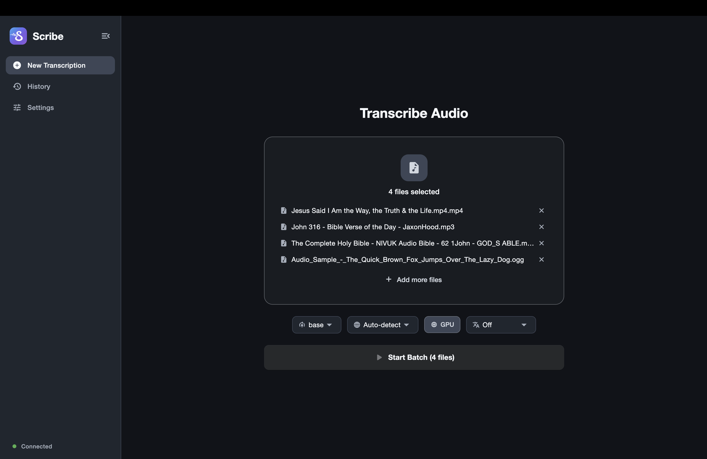

# Scribe

[](#quick-start)
[](#development)
[](#model-management)
[](#features)
[](#translation)
[](#screenshots)

Scribe is a local-first desktop transcription app for offline audio and video transcription with live editing, optional translation, and export-ready output.

<p align="left">
  
</p>

## Screenshots


## Features

- Batch transcription queue for processing multiple files in one run.
- Live segment streaming with in-place transcript editing.
- History management for opening, exporting, and deleting past jobs.
- Export formats: TXT, SRT, VTT, JSON, CSV.
- Local model management: download, delete, and inspect Whisper model storage.
- GPU-aware inference with configurable compute types (`auto`, `int8`, `float16`, `float32`).
- Optional translation in the transcription flow (`en`, `es`, `fr`, `de`, `it`, `pt`, `ja`, `zh`, `ko`).
- Two backend modes: managed mode for app-controlled backend lifecycle, and external mode for connecting to your own backend service.

## Backend Modes

- Managed mode: Scribe launches and manages the backend process for you, including automatic free-port selection on localhost.
- External mode: Scribe connects to an already-running backend. The default endpoint is `127.0.0.1:50051`.

Managed mode is recommended for most users. External mode is useful for development, remote debugging, and custom backend deployments.

## Model Management

Whisper models are stored locally in `shared/models/` and reused across runs.

- `tiny` / `tiny.en` (~39 MB): fastest, lowest accuracy.
- `base` / `base.en` (~74 MB): balanced default.
- `small` / `small.en` (~244 MB): better accuracy.
- `medium` / `medium.en` (~769 MB): high accuracy.
- `large-v1` / `large-v2` / `large-v3` / `large` (~1.5 GB): highest accuracy, largest footprint.

## GPU Acceleration

Scribe selects hardware-aware defaults and falls back safely when acceleration is unavailable.

- NVIDIA GPUs: CUDA path with `float16` when available.
- Apple Silicon: optimized CPU path with `int8` default.
- AMD/DirectML environments: detected for tuning; current backend execution path falls back to CPU where needed.
- CPU-only systems: `int8` default for efficient local inference.

## Translation

Translation is optional and can be set per transcription job in the transcription toolbar.

- `Off`: keeps transcript text in the source language.
- `English (en)`: uses Whisper's native `translate` task during transcription.
- `Spanish`, `French`, `German`, `Italian`, `Portuguese`, `Japanese`, `Chinese`, `Korean`: transcribe first, then translate segments in the backend.

Non-English translation targets use a backend translation API call, so internet access is required for that translation path.

## Quick Start

```bash
git clone https://github.com/munalgar/scribe.git
cd scribe
```

Start backend:

```bash
bash scripts/dev_backend.sh
```

Start frontend:

```bash
bash scripts/dev_frontend.sh macos
```

For other desktop targets, replace `macos` with `windows` or `linux`.

## Prerequisites

- macOS: Python 3.10+, Flutter desktop support, FFmpeg (`brew install ffmpeg`), Protocol Buffers compiler (`brew install protobuf`), Dart protoc plugin (`dart pub global activate protoc_plugin`), Xcode Command Line Tools.
- Windows: Python 3.10+, Flutter desktop support, FFmpeg, Protocol Buffers compiler, Dart protoc plugin (`dart pub global activate protoc_plugin`), Visual Studio 2022 with C++ desktop tools.
- Linux: Python 3.10+, Flutter desktop support, FFmpeg (`sudo apt install ffmpeg`), Protocol Buffers compiler (`sudo apt install protobuf-compiler`), Dart protoc plugin (`dart pub global activate protoc_plugin`), build tools (`sudo apt install build-essential`).

## How It Works

1. Select one or more audio or video files.
2. Transcribe, review live segments, and edit text inline.
3. Export final transcripts in your preferred format.

## Development

Generate gRPC bindings:

```bash
bash scripts/gen_proto.sh
```

Build backend executable:

```bash
bash scripts/build_backend.sh
```

## Testing

Run backend tests:

```bash
python3 tests/test_backend.py
python3 tests/test_server.py
```

Run frontend tests:

```bash
cd frontend/flutter/scribe_app
flutter test
```

## Project Structure

```text
backend/                     # Python gRPC backend and transcription engine
frontend/flutter/scribe_app/ # Flutter desktop client
proto/                       # Shared gRPC/protobuf contract
scripts/                     # Dev and build scripts
shared/models/               # Local Whisper model cache
```

## License

Licensed under the MIT License. See [LICENSE](LICENSE).
