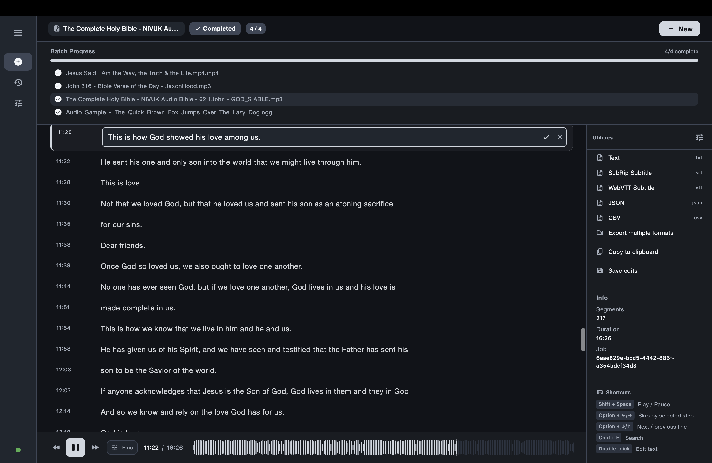
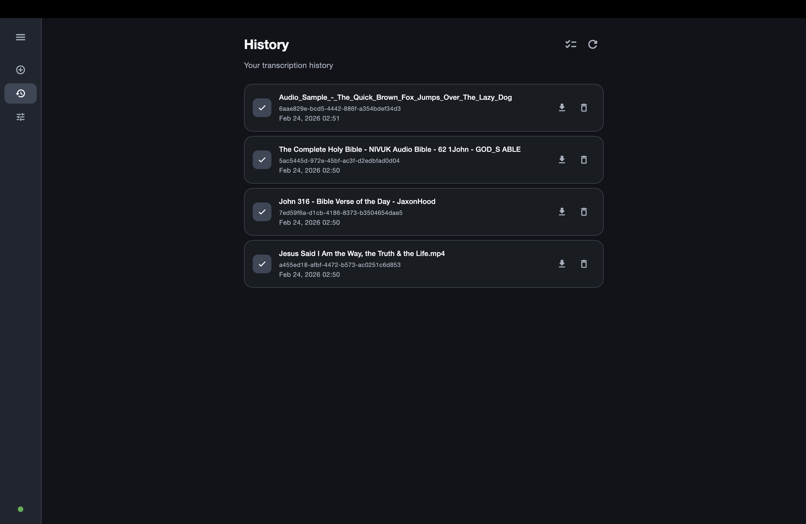
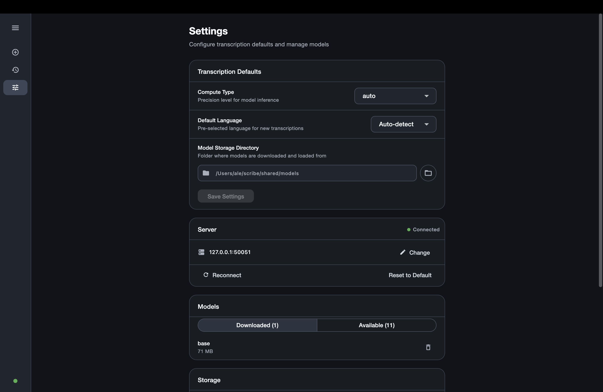

# Scribe

Scribe is a local-first desktop transcription app for offline audio/video transcription with editable transcripts and export-ready output formats.

## Screenshots






## Features

- Batch transcription queue for processing multiple files in one run.
- Live segment streaming with in-place transcript editing.
- History management for opening, exporting, and deleting past jobs.
- Export formats: TXT, SRT, VTT, JSON, CSV.
- Local Whisper model management with download, delete, and storage visibility.
- Compute type controls (`auto`, `int8`, `float16`, `float32`) for transcription defaults.
- Local backend connectivity with managed backend mode or manual server mode.

## Quick Start

```bash
git clone https://github.com/munalgar/scribe.git
cd scribe
```

Terminal 1:

```bash
bash scripts/dev_backend.sh
```

Terminal 2:

```bash
bash scripts/dev_frontend.sh macos
```

For other desktop targets, replace `macos` with `windows` or `linux`.
In external/manual mode, the default backend endpoint is `127.0.0.1:50051`.
In managed mode, the app auto-selects a free localhost port at startup.
Managed mode is the recommended default for end users; external mode is mainly for developer and advanced custom server workflows.

## Prerequisites

- macOS: Python 3.10+, Flutter with desktop support, FFmpeg (`brew install ffmpeg`), Protocol Buffers compiler (`brew install protobuf`), Dart protoc plugin (`dart pub global activate protoc_plugin`), Xcode Command Line Tools.
- Windows: Python 3.10+, Flutter with desktop support, FFmpeg, Protocol Buffers compiler, Dart protoc plugin (`dart pub global activate protoc_plugin`), Visual Studio 2022 with C++ desktop tools.
- Linux: Python 3.10+, Flutter with desktop support, FFmpeg (`sudo apt install ffmpeg`), Protocol Buffers compiler (`sudo apt install protobuf-compiler`), Dart protoc plugin (`dart pub global activate protoc_plugin`), build tools (`sudo apt install build-essential`).

## Model Management

Whisper models are stored locally under `shared/models/` by default and can be managed from Settings.

- `tiny` / `tiny.en` (~39 MB): fastest, lower accuracy.
- `base` / `base.en` (~74 MB): balanced default.
- `small` / `small.en` (~244 MB): better accuracy.
- `medium` / `medium.en` (~769 MB): high accuracy.
- `large-v1` / `large-v2` / `large-v3` / `large` (~1.5 GB): highest accuracy, largest footprint.

Models are downloaded on demand, then reused offline for future runs.

## GPU Acceleration

Scribe detects available hardware and picks an appropriate inference profile.

- NVIDIA GPUs: uses CUDA with `float16` when available.
- Apple Silicon: uses CPU path with `int8` default for fast local inference.
- AMD/DirectML environments: detected for tuning, with CPU execution fallback in current backend path.
- CPU-only systems: runs with `int8` by default.

You can override compute type in Settings per your speed/accuracy preference.

## How It Works

1. Select one or more audio/video files in the transcription view.
2. Run transcription, review live output, and edit segments inline.
3. Export results in the format your workflow needs.

## Development

Generate gRPC bindings:

```bash
bash scripts/gen_proto.sh
```

Build backend executable:

```bash
bash scripts/build_backend.sh
```

Build a desktop release bundle for the current host OS (includes backend + frontend):

```bash
python3 scripts/package_release.py
```

Create GitHub release downloads for Windows/macOS/Linux:

1. Push a version tag (for example: `git tag v1.0.0 && git push origin v1.0.0`).
2. GitHub Actions runs `.github/workflows/release.yml`.
3. The workflow publishes release assets:
   - `scribe-windows-<tag>.zip`
   - `scribe-macos-<tag>.zip`
   - `scribe-linux-<tag>.zip`

## Testing

Backend sanity checks:

```bash
python3 tests/test_backend.py
python3 tests/test_server.py
```

Frontend tests:

```bash
cd frontend/flutter/scribe_app
flutter test
```

## Project Structure

```text
backend/                     # Python gRPC backend and transcription engine
frontend/flutter/scribe_app/ # Flutter desktop client
proto/                       # Shared gRPC/protobuf contract
scripts/                     # Dev and build scripts
shared/models/               # Local Whisper model cache
```

## License

Licensed under the MIT License. See [LICENSE](LICENSE).
