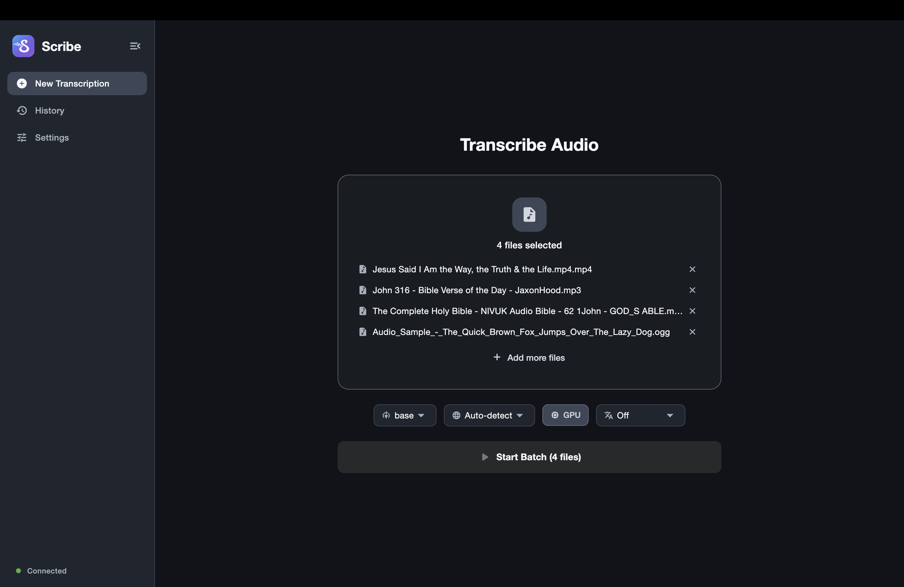
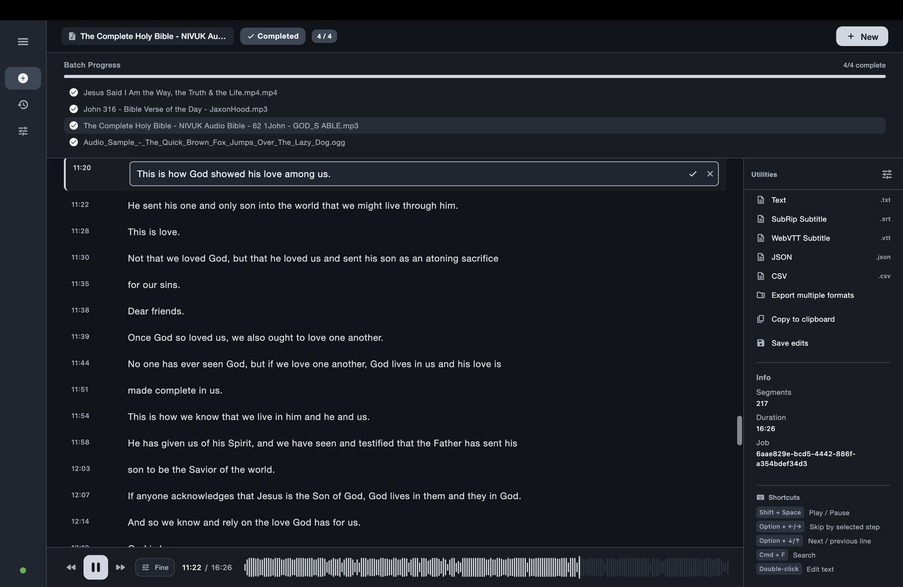
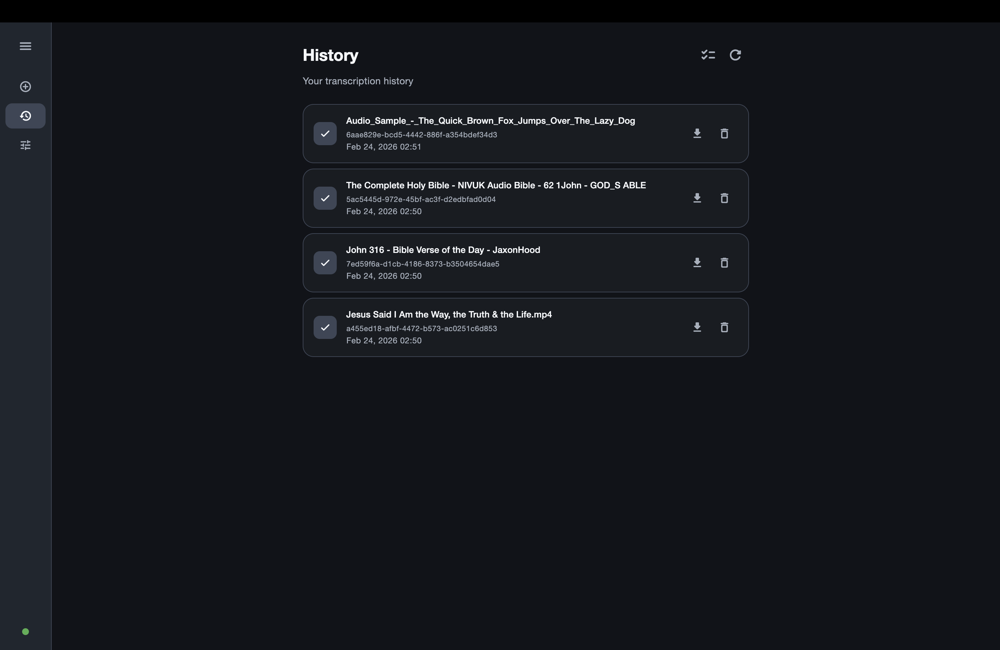
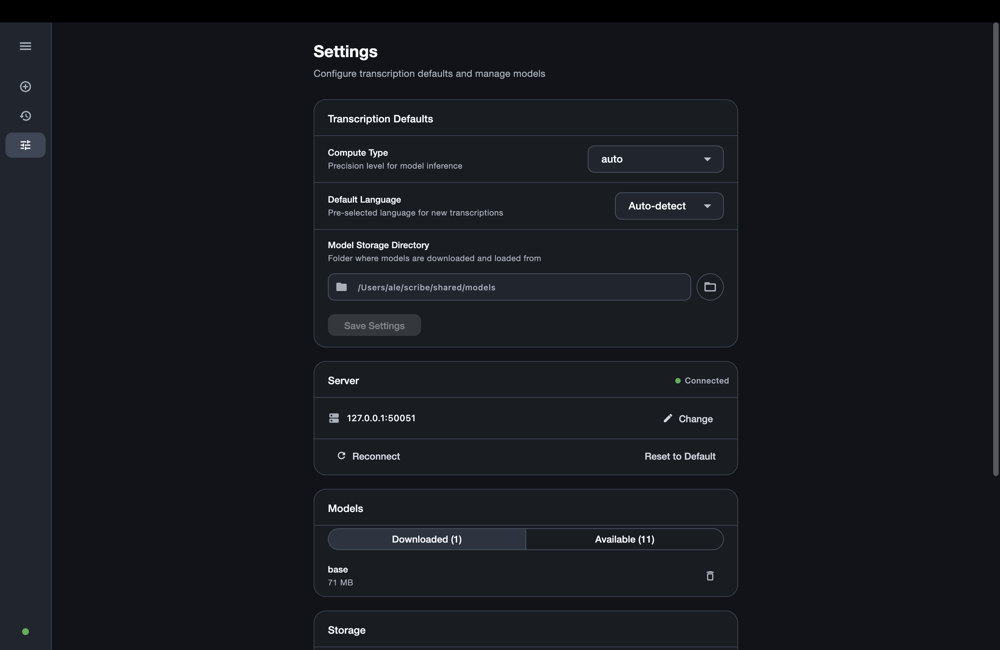

# Scribe

[](#download)
[](#development)
[](#model-management)
[](#features)
[](#translation)
[](#screenshots)

Scribe is a local-first desktop transcription app for offline audio and video transcription with live editing, optional translation, and export-ready output.

<p align="left">
  
</p>

## Download

Non-developers can download the latest packaged app from [GitHub Releases](https://github.com/munalgar/scribe/releases/latest):

- macOS: `scribe-macos-<version>.zip`
- Windows: `scribe-windows-<version>.zip`
- Linux: `scribe-linux-<version>.zip`

Extract the ZIP and launch `Scribe.app` on macOS or `Scribe.exe` on Windows. On Linux, launch the `Scribe` executable from the extracted directory. These packages include the Flutter application and the Python backend, so Flutter, Dart, Python, and Protocol Buffers are not required.

Current release architectures and runtime requirements:

- macOS: Apple Silicon (`arm64`). The package is not notarized; on first launch, Control-click `Scribe.app`, choose **Open**, and confirm the prompt.
- Windows: 64-bit Windows 10 or 11.
- Linux: x64 Linux compatible with Ubuntu 24.04. GTK 3 and common Flutter runtime libraries are required; on Ubuntu, install them with `sudo apt install libgtk-3-0 libblkid1 liblzma5`.

Whisper models are downloaded separately when selected in the app, so the first model setup requires internet access and additional disk space.

## Screenshots





## Features

- Batch transcription queue for processing multiple files in one run.
- Live segment streaming with in-place transcript editing.
- History management for opening, exporting, and deleting past jobs.
- Export formats: TXT, SRT, VTT, JSON, CSV.
- Local model management: download, delete, and inspect Whisper model storage.
- GPU-aware inference with configurable compute types (`auto`, `int8`, `float16`, `float32`).
- Optional translation in the transcription flow (`en`, `es`, `fr`, `de`, `it`, `pt`, `ja`, `zh`, `ko`).
- Two backend modes: managed mode for app-controlled backend lifecycle, and external mode for connecting to your own backend service.

## Backend Modes

- Managed mode: Scribe launches and manages the backend process for you, including automatic free-port selection on localhost.
- External mode: Scribe connects to an already-running backend. The default endpoint is `127.0.0.1:50051`.

Managed mode is recommended for most users. External mode is useful for development, remote debugging, and custom backend deployments.

## Model Management

Whisper models and transcription history are stored locally and reused across runs. Packaged releases use these per-user data directories:

- macOS: `~/Library/Application Support/Scribe/`
- Windows: `%LOCALAPPDATA%\Scribe\`
- Linux: `${XDG_DATA_HOME:-~/.local/share}/scribe/`

Source development keeps models in `shared/models/` and the database in `backend/data/`. The model directory can also be changed in Settings. Advanced deployments can override the packaged data directory with `SCRIBE_DATA_DIR` and the database file with `SCRIBE_DB_PATH`.

- `tiny` / `tiny.en` (~39 MB): fastest, lowest accuracy.
- `base` / `base.en` (~74 MB): balanced default.
- `small` / `small.en` (~244 MB): better accuracy.
- `medium` / `medium.en` (~769 MB): high accuracy.
- `large-v1` / `large-v2` / `large-v3` / `large` (~1.5 GB): highest accuracy, largest footprint.

## GPU Acceleration

Scribe selects hardware-aware defaults and falls back safely when acceleration is unavailable.

- NVIDIA GPUs: CUDA path with `float16` when available.
- Apple Silicon: optimized CPU path with `int8` default.
- AMD/DirectML environments: detected for tuning; current backend execution path falls back to CPU where needed.
- CPU-only systems: `int8` default for efficient local inference.

## Translation

Translation is optional and can be set per transcription job in the transcription toolbar.

- `Off`: keeps transcript text in the source language.
- `English (en)`: uses Whisper's native `translate` task during transcription.
- `Spanish`, `French`, `German`, `Italian`, `Portuguese`, `Japanese`, `Chinese`, `Korean`: transcribe first, then translate segments in the backend.

Non-English translation targets send transcript segments to the Google Translate endpoint at `translate.googleapis.com`. That text leaves the local device, and internet access is required. Transcription itself and translation to English through Whisper remain local after the selected model has been downloaded.

## Development Quick Start

```bash
git clone https://github.com/munalgar/scribe.git
cd scribe
```

Install the platform prerequisites below, then start the frontend and backend together.

macOS and Linux:

```bash
bash scripts/dev.sh
```

Windows PowerShell:

```powershell
.\scripts\dev.ps1
```

The desktop target is detected automatically. You can override it when needed, for example:

```bash
bash scripts/dev.sh macos
```

```powershell
.\scripts\dev.ps1 -Platform windows
```

The first run creates `.venv`, installs the Python and Flutter project dependencies, generates both sets of gRPC bindings, and starts the backend on `127.0.0.1:50051`. Closing Flutter or pressing `Ctrl+C` also stops the backend.

## Prerequisites

- All platforms: Python 3.10+, the [Flutter SDK](https://docs.flutter.dev/install) on `PATH` (which also provides `dart`), and the Protocol Buffers compiler. The development scripts install the Dart protoc plugin when needed.
- macOS: Xcode and its command-line tools. Install Protocol Buffers with `brew install protobuf`, follow the [Flutter macOS setup](https://docs.flutter.dev/platform-integration/macos/setup), then validate the toolchain with `flutter doctor`. Optionally install FFmpeg with `brew install ffmpeg`.
- Windows: Visual Studio 2022 with the Desktop development with C++ workload. Add Flutter and Protocol Buffers to `PATH`, optionally add FFmpeg, then run `flutter doctor`.
- Linux: install the desktop build dependencies with `sudo apt install clang cmake ninja-build pkg-config libgtk-3-dev liblzma-dev protobuf-compiler`, then run `flutter doctor` after installing Flutter.

FFmpeg is optional but recommended on every platform. When it is unavailable, transcription and playback still work, but waveform extraction falls back to an approximation and duration metadata may be unavailable.

If `protoc-gen-dart` exists but reports `dart: command not found`, the plugin launcher is present but the Flutter SDK is not on `PATH`. Fix the Flutter installation first; rerunning the platform development command will then install or update the plugin automatically.

## How It Works

1. Select one or more audio or video files.
2. Transcribe, review live segments, and edit text inline.
3. Export final transcripts in your preferred format.

## Development

Generate gRPC bindings:

```bash
bash scripts/gen_proto.sh
```

Generate only one language when working on a single side of the application:

```bash
bash scripts/gen_proto.sh --python-only
bash scripts/gen_proto.sh --dart-only
```

The backend and frontend can still be run separately for focused debugging:

```bash
bash scripts/dev_backend.sh
bash scripts/dev_frontend.sh macos
```

Build backend executable:

```bash
bash scripts/build_backend.sh
```

## Testing

Run backend tests:

```bash
.venv/bin/python -m unittest tests.test_paths
.venv/bin/python tests/test_backend.py
.venv/bin/python tests/test_server.py
```

On Windows PowerShell:

```powershell
.\.venv\Scripts\python.exe -m unittest tests.test_paths
.\.venv\Scripts\python.exe tests/test_backend.py
.\.venv\Scripts\python.exe tests/test_server.py
```

Run frontend tests:

```bash
cd frontend/flutter/scribe_app
flutter test
```

## Project Structure

```text
backend/                     # Python gRPC backend and transcription engine
frontend/flutter/scribe_app/ # Flutter desktop client
proto/                       # Shared gRPC/protobuf contract
scripts/                     # Dev and build scripts
shared/models/               # Local Whisper model cache
```

## License

Licensed under the MIT License. See [LICENSE](LICENSE).
